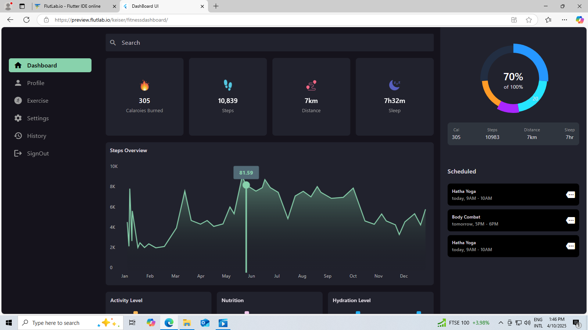
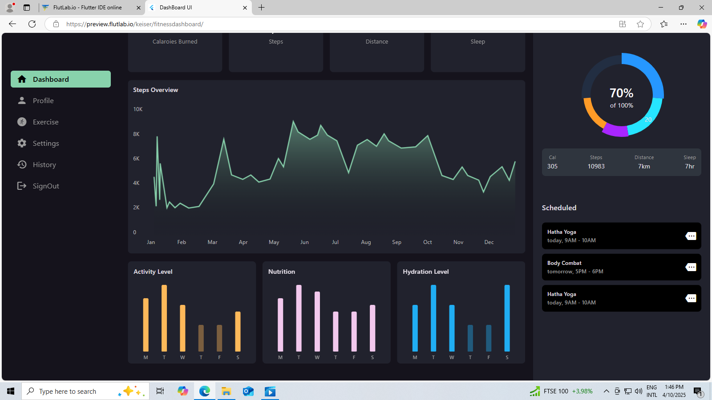

# 💪 Fitness Dashboard UI

This is a **Fitness Dashboard UI** project built with Flutter, aimed at practicing and learning how to create modern and functional interfaces for fitness data visualization. The interface simulates tracking physical activities like steps, calories burned, hydration, sleep, and nutrition.

> 🔧 This project is based on a YouTube tutorial, with several adjustments made by me to fix issues caused by outdated dependencies and ensure compatibility with newer versions of Flutter.

---

## 📸 Screenshots

### 📊 Dashboard Interface

---

## 🚀 Features

- Simulated fitness data visualization:
  - Daily steps
  - Calories burned
  - Distance walked
  - Sleep duration
  - Hydration and nutrition
- Interactive graphs (line and bar charts)
- Sidebar navigation menu:
  - Dashboard
  - Profile
  - Exercises
  - Settings
  - History
  - Logout
- Scheduled activities
- Modern and clean dark theme UI

---

## 🎯 Purpose

This project is not connected to any real database. It uses a local file (`data.dart`) with mock data for learning and UI development purposes only.

---

## 🛠️ Technologies Used

- [Flutter](https://flutter.dev/)
- [Dart](https://dart.dev/)
- [fl_chart](https://pub.dev/packages/fl_chart) — for charts
- [Google Fonts](https://pub.dev/packages/google_fonts) — for typography
- Navigation using `Navigator`
- Layouts using `Row`, `Column`, `Stack`, `GridView`, and more

---

## 📁 Folder Structure

lib/ ├── components/ │ ├── ...reusable widgets like cards, charts, and menu ├── data/ │ └── data.dart (mock values) ├── pages/ │ ├── dashboard.dart │ ├── profile.dart │ └── ... └── main.dart

---

## 📦 Getting Started

1. Clone the repository:
   git clone https://github.com/KeiserM/Fitness-Dashboard.git
   cd fitness_dashboard_ui
2. Install dependencies:
    flutter pub get
   
## 👨‍💻 Author
Developed by Keiser A. Manuel as part of my Flutter learning journey focused on building responsive and interactive UI designs.

📌 Note: This project was initially based on a YouTube tutorial, but I had to make several code updates and fixes due to outdated packages and compatibility issues. [link](https://www.youtube.com/watch?v=fVZqxpNdD6c&t=1239s)

## 🖼️ Image Credits
The screenshots are generated directly from this project. They can be found in the screenshots/ folder.

## 📌 License
This project is open-source and intended for educational purposes only.

